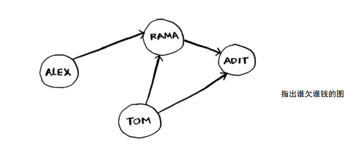
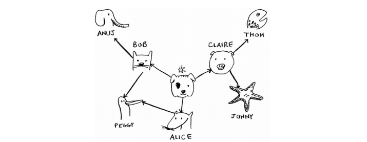
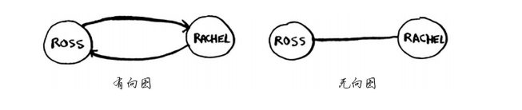

## 广度搜索优先
### 一、图简介
这种问题被称为最短路径问题（shorterst-path problem）。你经常要找出最短
路径，这可能是前往朋友家的最短路径，也可能是国际象棋中把对方将死的最少步数。
解决最短路径问题的算法被称为广度优先搜索。

### 二、图是什么

图由节点和边组成。一个节点可能与众多节点直接相连，这些节点被称为邻居。
在前面的欠钱图中， Rama是Alex的邻居。 Adit不是Alex的邻居，因为他们不直接相连。但Adit既
是Rama的邻居，又是Tom的邻居。

图用于模拟不同的东西是如何相连的。

### 三、广度优先搜索
广度优先搜索是一种用于图的查找算法，可帮助回答两类问题。

- 第一类问题：从节点A出发，有前往节点B的路径吗？
- 第二类问题：从节点A出发，前往节点B的哪条路径最短？

#### 3.1 查找最短路径
你需要按添加顺序进行检查。有一个可实现这种目的的数据
结构，那就是队列（queue） 。

#### 3.2 队列

队列的工作原理与现实生活中的队列完全相同。
假设你与朋友一起在公交车站排队，如果你排在他前
面，你将先上车。队列的工作原理与此相同。队列类
似于栈，你不能随机地访问队列中的元素。队列只支
持两种操作： 入队和出队。

队列是一种先进先出（First In First Out， FIFO）的数据结构，而栈是一种后进先出（Last In
First Out， LIFO）的数据结构。

### 四、实现图

首先，需要使用代码来实现图。图由多个节点组成。

每个节点都与邻近节点相连，如果表示类似于“你→Bob”
这样的关系呢？好在你知道的一种结构让你能够表示这种关
系，它就是散列表！

记住，散列表让你能够将键映射到值。在这里，你要将节
点映射到其所有邻居。

Anuj、 Peggy、 Thom和Jonny都没有邻居，这是因为虽然有指向他们的箭头，但没有从他们
出发指向其他人的箭头。这被称为有向图（directed graph） ，其中的关系是单向的。因此， Anuj
是Bob的邻居，但Bob不是Anuj的邻居。 无向图（undirected graph）没有箭头，直接相连的节点互
为邻居。例如，下面两个图是等价的。

### 五、实现算法
略

### 六、小结
- 广度优先搜索指出是否有从A到B的路径。
- 如果有，广度优先搜索将找出最短路径。
- 面临类似于寻找最短路径的问题时，可尝试使用图来建立模型，再使用广度优先搜索来
解决问题。
- 有向图中的边为箭头，箭头的方向指定了关系的方向，例如， rama→adit表示rama欠adit钱。
- 无向图中的边不带箭头，其中的关系是双向的，例如， ross - rachel表示“ross与rachel约
会，而rachel也与ross约会”。
- 队列是先进先出（FIFO）的。
- 栈是后进先出（LIFO）的。
- 你需要按加入顺序检查搜索列表中的人，否则找到的就不是最短路径，因此搜索列表必
须是队列。
- 对于检查过的人，务必不要再去检查，否则可能导致无限循环。

