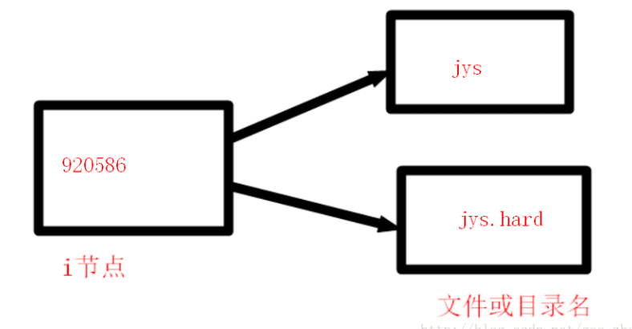
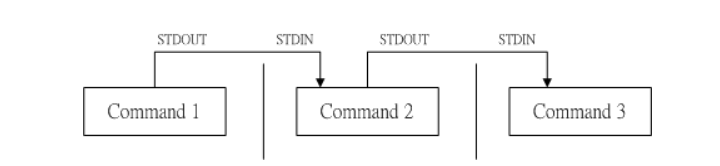

## 1. 硬链接和软连接区别?
- 建立软链接和硬链接的语法
``` 
软链接：ln -s 源文件 目标文件 
硬链接：ln 源文件 目标文件 
源文件：即你要对谁建立链接
```
-  什么是软链接和硬链接
>软链接可以理解成快捷方式。它和windows下的快捷方式的作用是一样的
>硬链接等于cp -p 加 同步更新

- 区别

软链接文件的大小和创建时间和源文件不同。软链接文件只是维持了从软链接到源文件的指向关系（从jys.soft->jys可以看出），不是源文件的内容，大小不一样容易理解。 
硬链接文件和源文件的大小和创建时间一样。硬链接文件的内容和源文件的内容一模一样，相当于copy了一份。

- 延伸 1

但是简单的copy的文件创建文件的时间应该是复制文件时的时间，肯定不会像硬链接那样和创建源文件的时间相同。你想的没错！
但是只要加一个选项-p,时间就一样了 。

那么cp -p的文件是不是就相当于硬链接了呢？其实不然，对于源文件的内容有修改，
硬链接文件会同步更新修改，始终保持和源文件的内容相同，而复制的文件则不可能做到这一点。

所以，硬链接等于cp -p加同步更新。 

软链接像快捷方式，方便我们打开源文件，这一点在windows中深有体会，那硬链接有哪些应用呢？ 
在多用户的操作系统里，你写一个脚本，程序等，没有完成，保存后等下次有时间继续写，
但是其他用户有可能将你未写完的东西当成垃圾清理掉，这时，你对你的程序，脚本等做一个硬链接，
利用硬链接的同步更新，就可以方式，别人误删你的源文件了。

- 删除源文件对软链接和硬链接的影响

`执行删除源文件操作`

查看软链接文件，查看的文件不存在。和windows一样，删除源文件，快捷方式也用不了。但是删除源文件，为什么硬链接文件还可以查看呢？ 
这里要简单说下i节点了。i节点是文件和目录的唯一标识，每个文件和目录必有i节点，不然操作系统就无法识别该文件或系统，就像没有上户口的黑户。
linux操作系统是不识别些字母的，像这些jys ,jys.hard操作系统根本不知道是什么玩意。

可以看出硬链接文件和源文件i节点号相同，并且一个i节点可以对应多个文件名。



如图，删除了jys,只是删除了从920586到jys的映射关系，不影响它和jys.hard的映射关系。
此图也解释了硬链接的同步更新，对源文件修改，操作系统只认i节点，
于是操作系统就将修改内容写进所有i节点相同名字不同的文件。

## 2. DNS解析过程

1. 在浏览器中输入www.qq.com域名，操作系统会先检查自己本地的hosts文件是否有这个网址映射关系，
   如果有，就先调用这个IP地址映射，完成域名解析。 
2. 如果hosts里没有这个域名的映射，则查找本地DNS解析器缓存，是否有这个网址映射关系，
   如果有，直接返回，完成域名解析。 
3. 如果hosts与本地DNS解析器缓存都没有相应的网址映射关系，首先会找TCP/ip参数中设置的首选DNS服务器，
   在此我们叫它本地DNS服务器，此服务器收到查询时，如果要查询的域名，包含在本地配置区域资源中，
   则返回解析结果给客户机，完成域名解析，此解析具有权威性。 
4. 如果要查询的域名，不由本地DNS服务器区域解析，但该服务器已缓存了此网址映射关系，则调用这个
   IP地址映射，完成域名解析，此解析不具有权威性。 
5. 如果本地DNS服务器本地区域文件与缓存解析都失效，则根据本地DNS服务器的设置（是否设置转发器）
   进行查询，如果未用转发模式，本地DNS就把请求发至13台根DNS，根DNS服务器收到请求后会判断这个域名
   (.com)是谁来授权管理，并会返回一个负责该顶级域名服务器的一个IP。本地DNS服务器收到IP信息后，
   将会联系负责.com域的这台服务器。这台负责.com域的服务器收到请求后，如果自己无法解析，
   它就会找一个管理.com域的下一级DNS服务器地址(qq.com)给本地DNS服务器。
   当本地DNS服务器收到这个地址后，就会找qq.com域服务器，重复上面的动作，进行查询，
   直至找到www.qq.com主机。 
6. 如果用的是转发模式，此DNS服务器就会把请求转发至上一级DNS服务器，
   由上一级服务器进行解析，上一级服务器如果不能解析，或找根DNS或把转请求转至上上级，以此循环。
   不管是本地DNS服务器用是是转发，还是根提示，最后都是把结果返回给本地DNS服务器，
   由此DNS服务器再返回给客户机。

**从客户端到本地DNS服务器是属于递归查询，而DNS服务器之间就是的交互查询就是迭代查询。**

详细参考：https://www.cnblogs.com/smilenana/p/3414077.html

## 3. kill 用法，某个进程杀不掉的原因（进入内核态，忽略 kill 信号）
- kill用法

先用查看进程id命令   ps -ef  ， 然后用杀死进程    kill -9 PID

- 进程杀不掉的原因
1. 进程已经成为僵尸进程，当它的父进程将它回收或将它的父进程kill掉，此时进程已经释放所有的资源，
但是没有被父进程释放（所以僵尸进程的存在不会影响系统性能）。僵尸进程要等到父进程结束，
或者重启系统才可以被释放。

2. 该进程处于”kernel mode”（内核态）且在等待不可获得的资源（类似于挂起）。Linux进程运行时分内核和用户两种状态，当进程进入内核状态后，
会屏蔽所有信号，包括SIGNAL，所以这个时候kill -9也变得无效了

### 4. linux 用过的命令

略

### 5. 系统管理命令（如查看内存使用、网络情况）
- df  和  df -hl  用来检查文件系统的磁盘空间占用情况，使用权限是所有用户
- top,   top命令用来显示执行中的程序进程，使用权限是所有用户（想对进程进行实时监控应该用top命令）
- free,  free命令用来显示内存的使用情况，使用权限是所有用户
- lp,  lp是打印文件的命令，使用权限是所有用户
- useradd,   useradd命令用来建立用户帐号和创建用户的起始目录，使用权限是超级用户
- kill 杀死进程
- ps -ef  查看进程完整信息（PS显示的是进程瞬间状态，不连续）
- ps -aux列出目前所有正在内存中的进程信息
- netstat  查看网络状态
### 6. 管道的使用(pipe)
bash 命令执行的时候有输出的数据会出现！ 那么如果这群数据必需要经过几
道手续之后才能得到我们所想要的格式，应该如何来设定？ 这就牵涉到管线命令的问题了 (pipe) ，
管线命令使用的是『 | 』这个界定符号！ 另外，管线命令与『连续下达命令』是不一样的呦！ 这
点底下我们会再说明。底下我们先举一个例子来说明一下简单的管线命令。

假设我们想要知道 /etc/ 底下有多少文件，那么可以利用 ls /etc 来查阅，不过， 因为 /etc 底下的文
件太多，导致一口气就将屏幕塞满了～不知道前面输出的内容是啥？此时，我们可以透过 less 指令
的协助，利用：

```
ls -al /etc | less
```

如此一来，使用 ls 指令输出后的内容，就能够被 less 读取，并且利用 less 的功能，我们就能够前
后翻动相关的信息了！很方便是吧？我们就来了解一下这个管线命令『 | 』的用途吧！ 其实这个管
线命令『 | 』仅能处理经由前面一个指令传来的正确信息，也就是 standard output 的信息，对于
stdandard error 并没有直接处理的能力。那么整体的管线命令可以使用下图表示：



在每个管线后面接的第一个数据必定是『指令』喔！而且这个指令必须要能够接受 standard input 的
数据才行，这样的指令才可以是为『管线命令』，例如 less, more, head, tail 等都是可以接受 standard
input 的管线命令啦。至于例如 ls, cp, mv 等就不是管线命令了！因为 ls, cp, mv 并不会接受来自
stdin 的数据。 也就是说，管线命令主要有两个比较需要注意的地方：

- 管线命令仅会处理 standard output，对于 standard error output 会予以忽略
- 管线命令必须要能够接受来自前一个指令的数据成为 standard input 继续处理才行。

### 7. 进程间的通信，共享内存方式的优缺点
#### 1. 由来
由于不同的进程运行在各自不同的内存空间中．一方对于变量的修改另一方是无法感知的．
因此．进程之间的信息传递不可能通过变量或其它数据结构直接进行，只能通进程间通信来完成。

#### 2. 分类
根据进程通信时信息量大小的不同，可以将进程通信划分为两大类型：
控制信息的通信和大批数据信息的通信．前者称为**低级通信**，后者称为**高级通信**。

**低级通信主要用于进程之间的同步、互斥、终止、挂起等等控制信息的传递。**

**高级通信主要用于进程间数据块的交换和共享 常见的高级通信有管道(PIPE)、消息队列(MESSAGE)、共享内存(SHARED MEM0RY)等**
#### 3. 高级通信的三种方式
1. 管道通信(PIPE)

两个进程利用管道进行通信时．发送信息的进程称为写进程．接收信息的进程称为读进程。
管道通信方式的中间介质就是文件．通常称这种文件为管道文件．它就像管道一样将一个写进程和一个读进程
连接在一起，实现两个进程之间的通信。写进程通过写入端(发送端)往管道文件中写入信息；读进程通过读出端
(接收端)从管道文件中读取信息。两个进程协调不断地进行写和读，便会构成双方通过管道传递信息的流水线。

利用系统调用PIPE()可以创建一个无名管道文件，通常称为无名管道或PIPE；利用系统调用MKNOD()可以创建一个有名管道文件．通常称为有名管道或FIFO。
无名管道是一种非永久性的管道通信机构．当它访问的进程全部终止时，它也将随之被撤消。无名管道只能用在具有家族联系
的进程之间。有名管道可以长期存在于系统之中．而且提供给任意关系的进程使用，但是使用不当容易导致出错．
所以操作系统将命名管道的管理权交由系统来加以控制管道文件被创建后，可以通过系统调用WRITE()和READ()
来实现对管道的读写操作；通信完后，可用CLOSE()将管道文件关闭。

2. 消息缓冲通信(MESSAGE)

多个独立的进程之间可以通过消息缓冲机制来相互通信．这种通信的实现是以消息缓冲区为中间介质．
通信双方的发送和接收操作均以消息为单位。在存储器中，消息缓冲区被组织成队列，通常称之为消息队列。
消息队列一旦创建后即可由多进程共享．发送消息的进程可以在任意时刻发送任意个消息到指定的消息队列上，
并检查是否有接收进程在等待它所发送的消息。若有则唤醒它：而接收消息的进程可以在需要消息的时候到指
定的消息队列上获取消息．如果消息还没有到来．则转入睡眠状态等待。

3. 共享内存通信(SHARED MEMORY)

 针对消息缓冲需要占用CPU进行消息复制的缺点．OS提供了一种进程间直接进行数据交换的通信方式一共享内存
 顾名思义．这种通信方式允许多个进程在外部通信协议或同步，互斥机制的支持下使用同一个内存段
 (作为中间介质)进行通信．它是一种最有效的数据通信方式，其特点是没有中间环节．
 直接将共享的内存页面通过附接．映射到相互通信的进程各自的虚拟地址空间中．
 从而使多个进程可以直接访问同一个物理内存页面．如同访问自己的私有空间一样
 (但实质上不是私有的而是共享的)。因此这种进程间通信方式是在同一个计算机系统中的诸进程间实现
 通信的最快捷的方法．而它的局限性也在于此．即共享内存的诸进程必须共处同一个计算机系统．
 有物理内存可以共享才行。

#### 4. 三种方式的特点（优缺点）
1. 无名管道简单方便．但局限于单向通信的工作方式．并且只能在创建它的进程及其子孙进程之间实现
   管道的共享：有名管道虽然可以提供给任意关系的进程使用．但是由于其长期存在于系统之中，
   使用不当容易出错。

2. 消息缓冲可以不再局限于父子进程．而允许任意进程通过共享消息队列来实现进程间通信．
   并由系统调用函数来实现消息发送和接收之间的同步．
   从而使得用户在使用消息缓冲进行通信时不再需要考虑同步问题．使用方便，
   但是信息的复制需要额外消耗CPU的时间．不适宜于信息量大或操作频繁的场合。

3. 共享内存针对消息缓冲的缺点改而利用内存缓冲区直接交换信息，
   无须复制，快捷、信息量大是其优点。但是共享内存的通信方式是通过将共享的
   内存缓冲区直接附加到进程的虚拟地址空间中来实现的．
   因此，这些进程之间的读写操作的同步问题操作系统无法实现。
   必须由各进程利用其他同步工具解决。另外，由于内存实体存在于计算机系统中．
   所以只能由处于同一个计算机系统中的诸进程共享。不方便网络通信。
   
#### 5.补充
1. 管道( pipe )：管道是一种半双工的通信方式，数据只能单向流动，而且只能在具有亲缘关系的进程间使用。进程的亲缘关系通常是指父子进程关系。

2. 有名管道 (named pipe) ： 有名管道也是半双工的通信方式，但是它允许无亲缘关系进程间的通信。

3. 信号量( semophore ) ： 信号量是一个计数器，可以用来控制多个进程对共享资源的访问。它常作为一种锁机制，防止某进程正在访问共享资源时，其他进程也访问该资源。因此，主要作为进程间以及同一进程内不同线程之间的同步手段。

4. 消息队列( message queue ) ： 消息队列是由消息的链表，存放在内核中并由消息队列标识符标识。消息队列克服了信号传递信息少、管道只能承载无格式字节流以及缓冲区大小受限等缺点。

5. 信号 ( sinal ) ： 信号是一种比较复杂的通信方式，用于通知接收进程某个事件已经发生。

6. 共享内存( shared memory)：共享内存就是映射一段能被其他进程所访问的内存，这段共享内存由一个进程创建，但多个进程都可以访问。共享内存是最快的IPC方式，它是针对其他进程间通信方式运行效率低而专门设计的。它往往与其他通信机制，如信号量，配合使用，来实现进程间的同步和通信。# 套接字( socket ) ： 套解口也是一种进程间通信机制，与其他通信机制不同的是，它可用于不同及其间的进程通信。

### 8. B树和B+树及B*树 
参考数据结构那块


