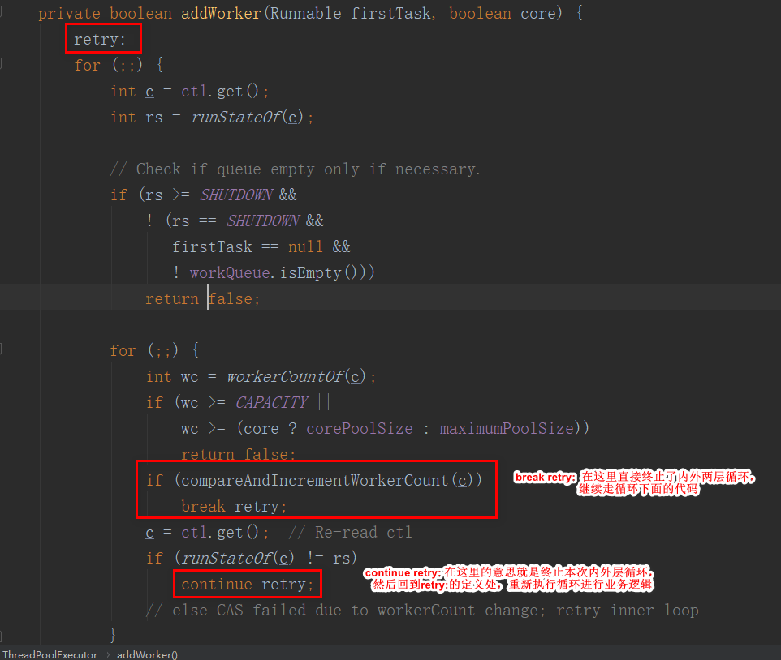

## Java中retry：的用法
### 一、示例

代码：
``` 
public class Main {

    public static void main(String[] args) throws Exception {
        retry:
        for (int i = 0; i < 10; i++) {
            if (i == 8) {
                break retry;
            }
            System.out.print(i + " ");
        }
    }
}
```

输出：
``` 
0 1 2 3 4 5 6 7 
```

此时我们好像并没有发现`retry:`的特殊之处。和我们之前写的结果一样（如下所示）,输出结果也和上面也是一样的。

``` 
public class Main {

    public static void main(String[] args) throws Exception {
        for (int i = 0; i < 10; i++) {
            if (i == 8) {
                break;
            }
            System.out.print(i + " ");
        }
    }
    
    // 输出也是 0 1 2 3 4 5 6 7 
}
```

下面让我们看一组复杂的使用来了解其使用。

代码：

``` 
public class Main {

    public static void main(String[] args) throws Exception {
        for (int i = 0; i < 10; i++) {
            System.out.println(" i = " + i);
            for (int j = 10; j < 20; j++) {
                if (j == 15) {
                    break;
                }
                System.out.println(" j = " + j);
            }
        }
    }
}
```

输出：
``` 
 i = 0
 j = 10
 j = 11
 j = 12
 j = 13
 j = 14
 i = 1
 j = 10
 j = 11
 j = 12
 j = 13
 j = 14
 i = 2
 j = 10
 j = 11
 j = 12
 j = 13
 j = 14
 i = 3
 j = 10
 j = 11
 j = 12
 j = 13
 j = 14
 i = 4
 j = 10
 j = 11
 j = 12
 j = 13
 j = 14
 i = 5
 j = 10
 j = 11
 j = 12
 j = 13
 j = 14
 i = 6
 j = 10
 j = 11
 j = 12
 j = 13
 j = 14
 i = 7
 j = 10
 j = 11
 j = 12
 j = 13
 j = 14
 i = 8
 j = 10
 j = 11
 j = 12
 j = 13
 j = 14
 i = 9
 j = 10
 j = 11
 j = 12
 j = 13
 j = 14
```

可以看出来，**外层循环是从0循环到10；而内层循环由于外层循环也循环了10此，并且每次到打印值到15就停止了**。

**<font color='red'>但是实际项目中我们往往可能需要只要内层循环终止了（break了），就把整个对应的外层循环也停止了，
不需要再进行一些额外的循环判断</font>**。

而此时`retry：`就派上用场了。如下：

``` 
public class Main {

    public static void main(String[] args) throws Exception {
        retry:
        for (int i = 0; i < 10; i++) {
            System.out.println(" i = " + i);
            for (int j = 10; j < 20; j++) {
                if (j == 15) {
                    break retry;
                }
                System.out.println(" j = " + j);
            }
        }
    }
}
```

输出：
``` 
 i = 0
 j = 10
 j = 11
 j = 12
 j = 13
 j = 14
```

这样就实现了我们刚刚想要的效果。在实际项目代码中，示例的两个嵌套for循环，
很有可能是自旋性质的循环（也是常说的死循环），常常用于固定条件的值的检测工作。


### 二、使用
1. retry就是一个**标记**，标记程序跳出循环的时候从哪里开始执行，功能类似于goto。
2. retry一般情况下：一是常常**跟随**for**循环**或while循环出现；
   二就是常常**跟随continue或是break**，用于继续和退出循环后恢复到retry标记位置处。
3. **retry的命名不是固定，只要符合Java的命名规范即可**。例如retry1, retry2等等这样的名称都是合法的
### 三、应用和拓展
1. 线程池源码中使用

   ThreadPoolExecutor#addWorker(Runnable firstTask, boolean core)
   
   
   
   对线程池实现原理感兴趣的同学可以深入研究下，在这里把源码贴出来。
   
   ``` 
       private boolean addWorker(Runnable firstTask, boolean core) {
           retry:
           for (;;) {
               int c = ctl.get();
               int rs = runStateOf(c);
   
               // Check if queue empty only if necessary.
               if (rs >= SHUTDOWN &&
                   ! (rs == SHUTDOWN &&
                      firstTask == null &&
                      ! workQueue.isEmpty()))
                   return false;
   
               for (;;) {
                   int wc = workerCountOf(c);
                   if (wc >= CAPACITY ||
                       wc >= (core ? corePoolSize : maximumPoolSize))
                       return false;
                   if (compareAndIncrementWorkerCount(c))
                       break retry;
                   c = ctl.get();  // Re-read ctl
                   if (runStateOf(c) != rs)
                       continue retry;
                   // else CAS failed due to workerCount change; retry inner loop
               }
           }
   
           boolean workerStarted = false;
           boolean workerAdded = false;
           Worker w = null;
           try {
               w = new Worker(firstTask);
               final Thread t = w.thread;
               if (t != null) {
                   final ReentrantLock mainLock = this.mainLock;
                   mainLock.lock();
                   try {
                       // Recheck while holding lock.
                       // Back out on ThreadFactory failure or if
                       // shut down before lock acquired.
                       int rs = runStateOf(ctl.get());
   
                       if (rs < SHUTDOWN ||
                           (rs == SHUTDOWN && firstTask == null)) {
                           if (t.isAlive()) // precheck that t is startable
                               throw new IllegalThreadStateException();
                           workers.add(w);
                           int s = workers.size();
                           if (s > largestPoolSize)
                               largestPoolSize = s;
                           workerAdded = true;
                       }
                   } finally {
                       mainLock.unlock();
                   }
                   if (workerAdded) {
                       t.start();
                       workerStarted = true;
                   }
               }
           } finally {
               if (! workerStarted)
                   addWorkerFailed(w);
           }
           return workerStarted;
       }
   ```