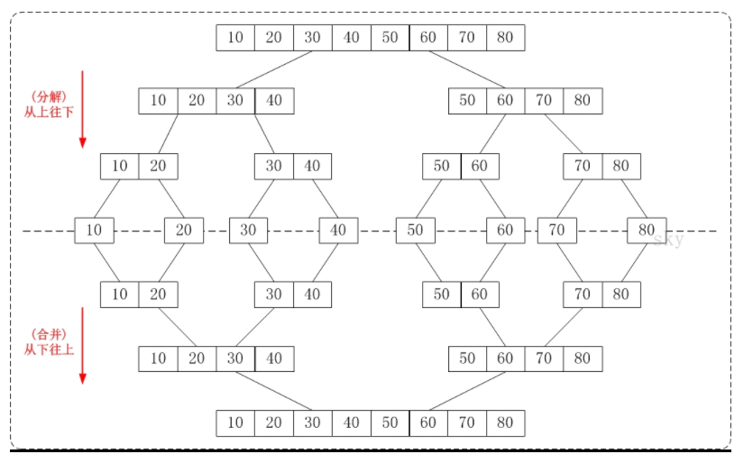

## 5、归并排序（Merge Sort）
将两个的有序数列合并成一个有序数列，我们称之为"归并"。

归并排序(Merge Sort)就是利用归并思想对数列进行排序。根据具体的实现，归并排序包括"从上往下"和"从下往上"2种方式。
### 5.1 算法实现
1. 从下往上的归并排序：将待排序的数列分成若干个长度为1的子数列，然后将这些数列两两合并；得到若干个长度为2的有序数列，再将这些数列两两合并；得到若干个长度为4的有序数列，再将它们两两合并；直接合并成一个数列为止。这样就得到了我们想要的排序结果。(参考下面的图片)

2. 从上往下的归并排序：它与"从下往上"在排序上是反方向的。它基本包括3步：
   ① 分解 -- 将当前区间一分为二，即求分裂点 mid = (low + high)/2;
   ② 求解 -- 递归地对两个子区间a[low...mid] 和 a[mid+1...high]进行归并排序。递归的终结条件是子区间长度为1。
   ③ 合并 -- 将已排序的两个子区间a[low...mid]和 a[mid+1...high]归并为一个有序的区间a[low...high]。
### 5.2 算法图解

### 5.3 算法实现
```
public class MergeSort {

    /**
     *
     * Merge Sort是我们学习的第一个O(nlogn)复杂度的算法
     * 可以在1秒之内轻松处理100万数量级的数据
     * 注意：不要轻易尝试使用SelectionSort, InsertionSort或者BubbleSort处理100万级的数据
     * 否则，你就见识了O(n^2)的算法和O(nlogn)算法的本质差异
     *
     * @param args
     */
    public static void main(String[] args) {
        int[] arr = {-9, 12, 8, 55, 84, -90, 25, 28, 25, 3};
        sort(arr);
        System.out.println(Arrays.toString(arr));

    }

    public static void sort(int[] arr) {
        sort(arr, 0, arr.length - 1);
    }

    /**
     * 递归使用归并排序,对arr[l...r]的范围进行排序
     *
     * @param arr
     * @param l
     * @param r
     */
    private static void sort(int[] arr, int l, int r) {
        if (l >= r) {
            return;
        }
        // 隐藏bug：待优化
        int mid = (l + r) / 2;
        sort(arr, l, mid);
        sort(arr, mid + 1, r);
        merge(arr, l, mid, r);
    }

    /**
     * 将arr[l...mid]和arr[mid+1...r]两部分进行归并
     *
     * @param arr
     * @param l
     * @param mid
     * @param r
     */
    private static void merge(int[] arr, int l, int mid, int r) {
        // 拷贝一个同样的数组出来，用于数据处理
        int[] aux = new int[r - l + 1];
        for (int i = l; i <= r; i++) {
            aux[i - l] = arr[i];
        }

        // 初始化，i指向左半部分的起始索引位置l；
        //        j指向右半部分起始索引位置mid+1
        int i = l, j = mid + 1;
        for (int k = l; k <= r; k++) {
            // 如果左半部分元素已经全部处理完毕
            if (i > mid) {
                arr[k] = aux[j - l];
                j++;
            // 如果右半部分元素已经全部处理完毕
            } else if (j > r) {
                arr[k] = aux[i - l];
                i++;
            // 左半部分所指元素 < 右半部分所指元素
            } else if (aux[i - l] < aux[j - l]) {
                arr[k] = aux[i - l];
                i++;
            // 左半部分所指元素 > 右半部分所指元素
            } else {
                arr[k] = aux[j - l];
                j++;
            }
        }
    }
}
```
### 5.4 其他
自下而上的方式实现：


