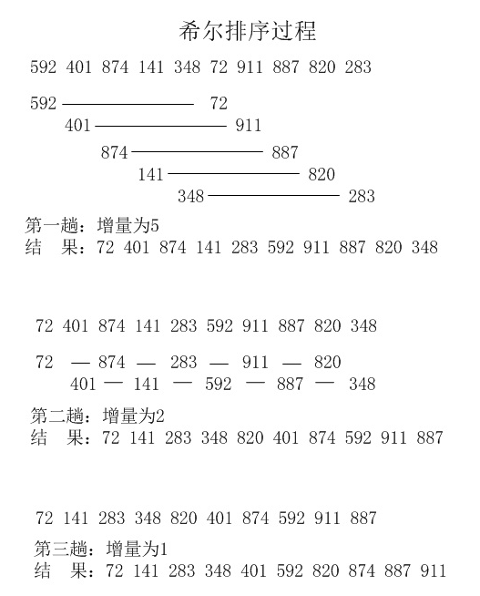

## 4、希尔排序（Shell Sort）
1959年Shell发明，第一个突破O(n2)的排序算法，是简单插入排序的改进版。它与插入排序的不同之处在于，它会优先比较距离较远的元素。希尔排序又叫缩小增量排序。
### 4.1 算法描述
先将整个待排序的记录序列分割成为若干子序列分别进行直接插入排序，具体算法描述：

- 择一个增量序列t1，t2，…，tk，其中ti>tj，tk=1；
- 按增量序列个数k，对序列进行k 趟排序；
- 每趟排序，根据对应的增量ti，将待排序列分割成若干长度为m 的子序列，分别对各子表进行直接插入排序。仅增量因子为1 时，整个序列作为一个表来处理，表长度即为整个序列的长度。
### 4.2 动图演示

### 4.3 代码实现
```
    public static void main(String[] args) {
        int[] arr = {-9, 12, 8, 55, 84, -90, 25, 28, 25, 3};
        shellSort(arr);
        System.out.println(Arrays.toString(arr));
    }

    public static void shellSort(int[] arr) {
        // 1. int gap = arr.length / 3;
        //~~
        // 2.动态设置gap的值
        int gap = 1;
        while (gap < arr.length / 3) {
            gap = gap * 3  + 1;
        }
        while (gap >= 1) {
            for (int i = gap; i < arr.length; i++) {
                int temp = arr[i];
                int j = i - gap;
                while (j >= 0 && arr[j] > temp) {
                    arr[j + gap] = arr[j];
                    j -= gap;
                }
                arr[j + gap] = temp;
            }
            gap = gap/3;
        }
    }
```


### 4.1 算法描述
